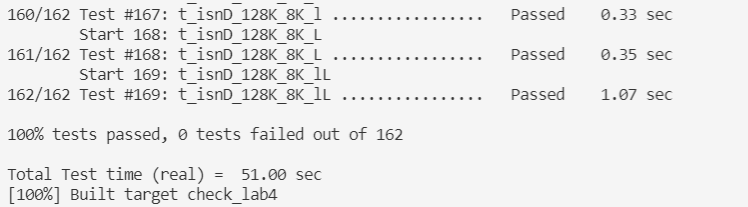

# CS144 斯坦福2021秋季计算机网络实验

cs144官网：https://cs144.github.io/

参考博客：http://doraemonzzz.com/tags/CS144/    https://kiprey.github.io/tgs/CS144/

## lab0

实验零有两小部分。分别是实现和手动获取网页相同功能的函数和实现内存字节流读取可靠服务

### 手动获取网页

补充get_URL函数，代码量10几行

此部分关键点一我觉得是通过套接字和采用http协议的服务器沟通时，每行命令结束应该以\r\n结束，最后键入所有命令后同样要写入\r\n，如

GET /hello HTTP/1.1

Host: http://cs144.Keithw.org

Connection: close

你在写程序时应该这样"GET " + path + " " + "HTTP/1.1\r\nHost: " + host + "\r\nConnection: close\r\n\r\n"。

其次是注意库函数和相关参数的使用，例如调用shutdown函数时注意传入的参数，第一次我传入SHUT_RDWT,导致报错：read: Connection reset by peer

最后，我觉得本实验的关键点是对套接字编程的掌握，如果熟练地掌握了套接字编程，则能够轻松拿下本关，故时隔四个月后，我再来记录下套接字最基本的相关系统调用和知识点

### 套接字编程

此处以berkely套接字接口为准，berkely套接字接口相当于是事实上的套接字接口标准（此处可自行google）

#### socket

函数原型：int socket(int domain, int type, int protocol)

作用：建立一个协议族为domain，类型为type，协议编号为protocol的套接字接口，返回值为该套接字文件描述符

#### bind

函数原型：int bind(int sockfd, const struct sockaddr *addr, socklen_t addrlen)

作用：将套接字和端口号，ip地址绑定在一起。addr为地址，类型为结构体，addrlen则表示结构体大小。客户通信不需要bind，服务器会直接从报文中取出客户ip
    
struct sockaddr {
   sa_family_t sa_family;    // 表示使用什么协议族的ip
   char        sa_data[14];  // 存放ip和端口，直接写入有点麻烦，可以通过写入struct sockaddr_in然后强转
}

#### listen（一般用于服务端）

函数原型：int listen(int sockfd, int backlog)

作用：将套接字文件从主动转为被动文件描述符，用于监听客户端。backlog为队列容量。因为连接请求只能由客户端发起，此时服务端的listen函数是将服务端的主
动描述符转为被动描述符，否则无法用于监听客户端的连接。

#### connect（一般用于客户端）

函数原型：int connect(int sockfd, const struct sockaddr *addr, socklen_t addrlen)

作用：用于客户端和服务端的连接，sockfd是自生套接字描述符，后两者是服务端地址与长度。调用此函数会激发tcp三次握手

#### accept（一般用于服务端）

函数原型：int accept(int sockfd, struct sockaddr *addr, socklen_t *addrlen)

作用：被动监听客户端发起的tcp连接请求，三次握手后连接建立成功。客户端connect函数请求发起连接。sockfd 已经被listen转为了被动描述符的“套接字文件描述符”，专门用于客户端的监
听，addr 用于记录发起连接请求的那个客户端的IP端口建立连接时服务器的TCP协议会自动解析客户端发来的数据包，从中获取客户端的IP和端口号这里如果服务器应用层需要用到客户端的 IP和
端口号，可以给accept指定第二个参数addr,以获取TCP链接时的客户端ip和端口号；如果服务器应用层不需要，则写NULL即可。至于如何获取客户端地址，addr是paramout，懂得都懂。

#### send（通过socket发送数据）

函数原型：ssize_t send(int sockfd, const void *buf, size_t len, int flags)

作用：向对方发送数据。buf存储要发送的字节流，len表示字节流长度，flags表示阻塞和非阻塞发送，还有sendto函数，多了const struct sockaddr *dest_addr, socklen_t addrlen两个参数
，一般用于udp通信。

#### recv（通过socket接收数据）

函数原型：ssize_t recv(int sockfd, void *buf, size_t len, int flags);

作用：接收数据，参数见上，同样还有recvform，和sendto对应。注意，当send和recv的flag为0时，和read，write作用一样

#### close

函数原型：int close(int sockfd)

作用：close 一个套接字的默认行为是把套接字标记为已关闭，然后立即返回到调用进程，该套接字描述符不能再由调用进程使用，也就是说它不能再作为read或write的第一个参数，然而TCP将
尝试发送已排队等待发送到对端的任何数据，发送完毕后发生的是正常的TCP连接终止序列。在多进程并发服务器中，父子进程共享着套接字，套接字描述符引用计数记录着共享着的进程个数，当
父进程或某一子进程close掉套接字时，描述符引用计数会相应的减一，当引用计数仍大于零时，这个close调用就不会引发TCP的挥手断连过程。

#### shutdown

函数原型：int shutdown(int sockfd, int how)

作用：直接断开当前套接字代表的连接，不管多少引用（和close区别），how 表示如何断开连接

### 内存可靠字节流

在我们完成wget小程序后，我们领悟到了底层tcp可靠传输的重要性，这个小实验以及未来的四个实验，将会让我们完成一个完整的tcp协议！！！我们从内存可靠字节流开始，这个实验可以让我们
可靠不出错地从内存中读取和写入字节流。

过程则是实现byte_stream.hh里面的ByteStream类相关函数，为方便代码编写可加入相关字段。对于缓冲区数据结构选取，我选的是链表，这有点类似于双端队列，选取list可方便头部的删除和
尾部的添加，而数组则没有这个优势，这个内存缓冲区大小可变，在内存大小方面两者相差无几，故我选择链表。

writer和reader相关接口则是很简单，注意设置相关字段存储相关变量即可。

注意：
我开始实现时是read完结束时，给have_read变量一次性加上读取长度，可是测试不给我通过，我后来改成每pop一个have_read加1，给通过了。估计是底测试程序测试时要求每读一个就要加一
个。还有就是eof的判断必须是缓冲区大小为0并且已经结束写入了才能返回true。

## lab1

实验一是实现一字节流重组器，将失序的字节流小块按顺序组装。字节流重组器将会被嵌入下一个lab的TCPreciever中，如果此实验不健壮（很多现在测不出来的bug会在后面暴露无遗！！！）影
响你写后续实验正确性！！！所以一定要足够健壮，能够处理所有传入字节流区间的情况。

### 关键点

#### 重叠

传进来的字节段的区间什么情况都有，字节流小块是有重叠的，甚至会包含，开始我以为像教材上一样，只会失序，而不会重叠（怪自己没好好看指导书），这是最关键的地方，也是最难解决的地
方，解决好重叠这个关键点，实验思路基本理清

#### 数据结构

第二个是数据结构的选取，我开始选择的是链表，使用插入排序使得index有序，可是后来发现使用map可以使查找时间复杂度降到logn（对cpp不熟悉），果断使用map，通过使用map保存所有传入
但失序的字节段以及其start。

### 编码思路

我没有添加辅助方法，所有处理都是实现在push_substring中，特别强大（甚至为实验三省写不少代码）。思路如下：首先对加入的data字符串进行切割，在map中找出和data重叠部分，进行切
割，用start和len存储，最后调用sunstr。之后看是否能够写入_output能则写入，之后在map中弹出最小index直至不能加入，最后是后处理。具体步骤如下：

+ start：data子串的开始index
+ len：子串长度。注意，我们是通过修改start来对其进行切割

+ 流程：
    - 对传入的data，在map中找上界up
        * 找到，判断是否交叉，交叉则判断是否被包围，包围则结束，否则修改start为up->first+up->second.size()-index;
        * 没有找到，判断index是否<=hope_to_rec,是则进行相应剪切和丢弃；
      
    - 在map中找下界down
        * 找到，判断是否交叉，交叉则判断是否包围，包围则删除down，继续2，否则修改len为down->first-start;否则直接插入，结束；
        * 没有找到，判断start是否越界，越界则丢弃，结束，否则插入map，结束；
      
    - 进行判断是否能写入_output，能则写入，判断是否全部写入，没有则将剩余插入map
    
    - 若成功写入且缓冲区未溢出，则在map中拿出第一个尝试写入，能则重复
  
    - 求eof_idx，若满足eof_idx<=hope_to_rec则结束写入

相关细节可见lab1代码注释

## lab2

实验二实现一个 TCPReceiver，用以接收传入的 TCP segment 并将其转换成用户可读的数据流。分为两个部分，索引转换和TCPReceiver 实现。

### 索引转换

在TCP中，每个字节在数据流中的索引用一个32位的“序列号”（seqno）表示，这就增加了一些复杂性：

开始和结束都算作序列中的一个位置，但是，在缓冲区中却不占位置，所以这里一定要区分序列中的序号和缓冲区中的序号：除了确保收到所有字节的数据外，TCP必须确保也能收到流的开始和结
束。因此，在TCP中，SYN（数据流的开始）和FIN（数据流的结束）标志都被分配了序列号
    
32位封装的序列号：在我们的StreamReassembler中，索引总是从0开始，并且有64位，在TCP中，传输的序列号是32位，如果数据流足够长的话，序列号就会循环
    
TCP序列号不从零开始：为了提高安全性和避免不同连接之间的混淆，TCP试图确保序列号不能被猜到，而且不太可能重复。因此，一个流的序列号不从零开始。流中的第一个序列号通常是一个随机
的32位数字，称为初始序列号（ISN）
    
实现两个函数，wrap（绝对序列号转序列号）和unwrap（序列号转绝对序列号）。

这里我详细说一下为啥要绝对序列号和序列号

绝对序列号从0开始，最大为2的64次方-1，而序列号用于tcp中传递，从初始序列号开始，在0 ~ 2^32 -1区间循环。

#### 绝对序列号转序列号

这个简单，待转换的绝对序列号加上初始序列号，再取余数2的32次方即可，这里有个问题，万一待转换的绝对序列号加上初始序列号超过2的64次方，即溢出，结果还可靠吗？可靠，下证明：

设待转换的绝对序列号为x(x<2^64)，初始序列号为y(y<2^32)，要证此命题正确，即证在 x+y >= 2^64且 x+y < 2^64 + 2^32 - 1的情况下，(x+y) % 2^64 == (x+y) % 2^32，显然成立（手动狗
头）。

#### 序列号转绝对序列号

通过recent absolute 64-bit sequence number：checkpoint做参考，首先获取wrap参考值checkpoint，因为要转换成为的绝对序列号不可能比checkpoint大2^32次方，然后使用无符号数使待转
换的序列号n和wrap值checkpoint的wrap值相减，注意一定要无符号。若wrap参考值checkpoint>2^31并且相减值加checkpoint值大于2^32，则减去2^32次方返回之。这是为了获取离checkpoint最
近的值。

### TCPReceiver

实现三个方法：

#### segment received
        
主要方法：对于 TCPReceiver 来说，除了错误状态以外，它一共有3种状态，分别是：

+ LISTEN：等待 SYN 包的到来。若在 SYN 包到来前就有其他数据到来，则必须丢弃
+ SYN_RECV：获取到了 SYN 包，此时可以正常的接收数据包
+ FIN_RECV：input_end，此时务必终止 ByteStream 数据流的输入
        
状态设置：
        
+ 当 isn 还没设置时，肯定是 LISTEN 状态
+ 当 ByteStream.input_ended()，则肯定是 FIN_RECV 状态
+ 其他情况下，是 SYN_RECV 状态

流程：

+ 一开始丢弃所有报文直到收到syn报文
+ 若缓冲区已经停止写入，则丢弃接收到的报文
+ 调用字节重组器接收报文
+ 更新下一期望字节序
   
        
#### ackno

ackno 的计算必须考虑到 SYN 和 FIN 标志，因为这两个标志各占一个 seqno。故在返回 ackno 时，务必判断当前 接收者处于什么状态，然后依据当前状态来判断
是否需要对当前的计算结果加1或加2。push_substring同样如此。函数返回一个可选的<WrappingInt32>，包含接收方尚未知道的第一个字节的序列号。
这就是窗口的左边缘：接收方感兴趣的第一个字节。如果ISN还没有被设置，返回一个空的可选值
        
#### window_size
        
求窗口大小,返回缓冲区剩余大小即可
        
   
   
## lab3
    
实验三实现了tcp发送方。以下是tcp_sender的主要功能：
    
每当可发送窗口大小变大，tcp_sender将尽可能多的ByteStream中的报文以tcp报文形式发送出去
    
当接收到ack报文时，更新窗口大小，通过已确认序列号将已发送但未确认tcp报文队列中已确认报文删除
    
当定时器过期时，重传已确认序列号将已发送但未确认tcp报文队列中中最早发出的tcp报文段，重启定时器
    
实验主要是实现四个方法，分别是fill_window，ack_received，tick以及send_empty_segment。以下是对三个方法功能的概述以及实现与坑点
  
### fill_window
    
+ 功能：TCPSender 从 ByteStream 中读取数据，并以 TCPSegement 的形式发送，尽可能地填充接收者的窗口。但每个TCP段的大小不得超过 TCPConfig::MAX PAYLOAD SIZE
        
+ 实现：首先注意TCPSender需要发送SYN报文，并且根据tcp协议，是不能携带数据段的，即payload为空，其次是syn（fin同理）不占payload空间，但是占发送窗口空间（坑点），所以发送
        SYN报文时，一定注意_next_seqno要记得+1。之后便是一个循环，当发送出去但未确认的报文长度大于等于窗口大小即退出循环，循环体中，从ByteStream读取数据段组成tcp报文发
        送，注意fin设置时机，当之前没有设置fin并且ByteStream已经结束输出，还有一个坑点（上面提到）就是win窗口需要有一个空间来发送fin，否则需要将fin留到下一次单独发送。
        还需注意，发送前需要检查未确认队列，为空则需要重启定时器。最后是避免两个死循环坑点：
        第一是数据报length_in_sequence_space为0
            - 发生这种情况，只能说明ByteStream没有数据并且还没有到eof阶段，此时如果不跳出，会造成死循环，此时上层将无法填充ByteStream，死循环将一直持续
        第二是已经发送出去fin报文
            - 发生这种情况，说明ByteStream没有数据并且已经到eof阶段，不跳出就死循环（和上面有略微差别）
                
### ack_received
        
+ 功能：收到接收方的ack，通过新的窗口大小及已确认报文序列ackno来进行更新
        
+ 实现：对ackno进行unwrap，若值大于期望值则直接返回，之后就是通过此值对未确认队列进行删除，删除时记得重启定时器。最后需要更新窗口大小，因为窗口大小被更新，可能需要重新填充，
        调用fill_window
        
### tick
    
+ 功能：每隔一段时间被调用一次，若超时，需要重传最早未被确认的报文段，如果窗口大小为非零，此时可能是因为网络拥塞造成数据包丢失，采取拥塞避免：跟踪连续重新传输的次数，并
            增加它，将RTO的值增加一倍（指数回退），之后启动重传timer
    
### send_empty_segment
    
+ 功能：发送空报文，注意填写tcp报头的seqno字段，实验四会用到
           
           
           
## lab4
实验四将之前写的sender和reciever结合起来，实现可以真正和其他世界各地计算机进行对话的tcp协议。
首先熟悉reciever状态：

然后熟悉sender状态：

最后熟悉tcp状态机：

同时阅读理解tcp_state.hh和tcp_state.cc源码。
在能将这三个图片熟悉（甚至背下来）后，关键在于理解三次握手和四次挥手，之后开始写相关函数，我将相关函数分为三类：

    + 连接函数
    
        - remaining_outbound_capacity
        
        - bytes_in_flight
        
        - unassembled_bytes
        
        - time_since_last_segment_received
        
        - active
        
        这几个函数只需要调用reciever或者sender的相关方法即可，或者返回自己设置的变量，如我设置的is_active表示tcp是否存活，较为简单
        
    
    + 填充函数
    
        - write
        
        - end_input_stream
        
        - connect
        
        这三个函数本质都是填充，write是向sender的streamin写字节流，end_input_stream为终止向sender的streamin写字节流，实际上就是向sender的streamin写fin（前面的实验告诉我们fin也         占一个字节），而connect，相当于写一个syn，也占一个字节。这三个函数需要注意在写完字节流或者终止字节流写入后一定要调用fillwindow方法，因为可能此时窗口大小够用，但是streamin却         为空，造成win空闲但是无字节流可写入的局面，此时一定要手动调用fill_window来“唤醒”sender。
        
    + 辅助函数
    
        - add_ack_and_win
        
        - set_rst
        
        这两个函数是自定义函数，起辅助功能，上面的两个个品种函数和下面的是cs144官方给出的接口，不能修改。add_ack_and_win主要是将sender的seg队列中的所有seg移到connection的seg队           列，这样才算是将sender发送的包发送出去了，发送出去之前要注意：加上ackno和win_size，这个方法一定要和fillwindow方法成对出现。而set_rst则是将自生置为错误状态，且根据传入的           bool参数判断是否发送rst包。
        
        
    + 状态相关函数
    
        - segment_received
        
        - tick
        
        这两个函数是tcp的核心，是最难的两个函数，和tcp状态密切相关，前两个品种的函数和状态无关，无需根据状态来采取不同行为。
        
        首先是segment_received函数，注意每次调用此函数首先是将离上一次收到seg的时间清零，之后判断其是否为rst包，是则直接调用set_rst自爆，注意传入false，因为这是被动自爆，无需发送         rst包。随后需要注意判断是否是ack包，如果是，则意味着需要将ackno和win两个参数传给sender，此时如果窗口变大，sender会发送数据包，然后需要判断是否需要发空包，只有在该包不是空的         ack包并且sender的seg队列为空，此时需要调用sender发送一个空包，但是不能立即发送。随后便是对11个状态中接收方最特殊的三个状态进行相应处理，分别是收到syn包、收到fin包和收到             finack包，具体状态的判断见tcp_state.hh和tcp_state.cc源码，但是不能原封不动按上面来判断，需小小改动，嘻嘻。方法最后，如果需要发空包，则发之，注意add_ack_and_win，不论是否         发空包，都需要调用此方法，仔细看我上面说的和add_ack_and_win解析。
        
        然后是tick方法，首先注意此方法开始注意将离上一次收到seg的时间增加，之后调用sender的tick，然后判断是否超时，超时则清空sender的seg队列，并且set_rst自爆，直接返回，注意传入的         参数哦。然后便是调用add_ack_and_win将重传包发送出去。这两个步骤不能颠倒，即不能先发包，再判断是否重传超过最大限制次数。最后需要注意判断是否到了time_wait阶段哦，如果到了此阶         段，if_linger为真，已经过了10倍的初始重传超时(_cfg.rt_timeout)时，即可关闭此tcp连接了。
        
        
        
好了最后便是将你写的所有代码整合起来

流量测试，勉强过关

最后回到梦开始的地方，将webget使用你自己写的tcp协议，和世界各地的计算机对话吧

## lab5

做完前面五个实验（尤其是实验四），后面就一马平川了。实验五是实现一个arp地址解析协议，主要是实现三个函数，下面是三个函数的实现思路：

    + send_datagram
    
    调用者(如你的TCPConnection或路由器)希望将出站互联网(IP)数据报发送到下一个跃点时，将调用此方法。(请不要把数据报的最终目的地与下一跳混为一谈，后者在数据报自己的报头中是目标地
    址。在这个实验里，你只关心下一跳的地址。)该接口的工作是将此数据报转换为以太网帧并(最终)发送。
    
    如果在自己实现的arp表中找到下一跃迁点对应的ip地址，填充以太网帧头，直接发送。
    
    如果没有找到，将此刻时间、下一跃迁点ip地址和ip报文存储起来，查表观测之前是否发送过arp请求报文，没有则发送之。
    
    
    + recv_frame
    
    以太网帧从网络到达时，调用此方法。只有目的地址是本机的或者是广播地址，我们才接收之。
    
    如果上层协议是ip，则解析并且返回之。
    
    如果上层协议是arp，则判断是请求包还是回复包，请求包则填充arp相关字段，发送之告诉本机mac地址，回复包则记住此映射，注意时间也得存储。在未回复的包中寻找，如果目的mac地址是此mac地
    址，发送之，然后将其从未回复的包队列删除（注意，可能有多个符合要求的未回复包）
    
    
    + tick
    
    注意，该方法将被定时调用，注意一切时间敏感的地方在此方法中都得处理，本实验有两个时间敏感的地方。
    
    一是每个arp映射只持续30秒，所以需遍历arp映射表，超时表项则被删除。
    
    二是每个待回复的包5秒没有收到回复mac地址，则必须重新发送
    
    

## lab6

本实验主要是实现路由转发，相当于实现一个特变简陋的路由器(你不需要实现设置路由表的算法，例如RIP、OSPF、BGP或SDN控制器，只需要实现跟随路由表的算法)，主要是两个功能：
    
    + 跟踪路由表(转发规则或路由列表)
    
    + 转发它收到的每个数据报
    
    主要是实现两个函数
    
    + add_route
    
    将一条路由添加到路由表中。你要在Router类中添加一个数据结构作为私有成员来存储这些信息。这个方法所要做的就是保存路由，以供以后使用
    
    + route_one_datagram
    
    将数据报路由到下一跳，从适当的接口传出。它需要实现IP路由器的”最长前缀匹配”逻辑，以找到最佳路由。注意：
    
        - 选择具有最大prefix_length的路由，这就是最长前缀匹配路由
        
        - 在C和C++中，将一个32位整数移位32位，可能会产生未定义行为。，故在判断子网时最好不要用移位
        
        - 如果路由器直接连到一个网络，那么next_hop将是一个空的可选项，在这种情况下，next_hop是数据报的目标地址。如果连接的是其他路由器，那么next_hop将包含路径中下一路由器的IP地
          址，通过适当的接口(interface(interface_num).send_datagram())发送到适当的下一跳
          
          
          
## 实验7

最后一个实验！！！不需要编写任何代码，日后来写（主要是测试）很简单。

    
        
  

    
  
    

   

