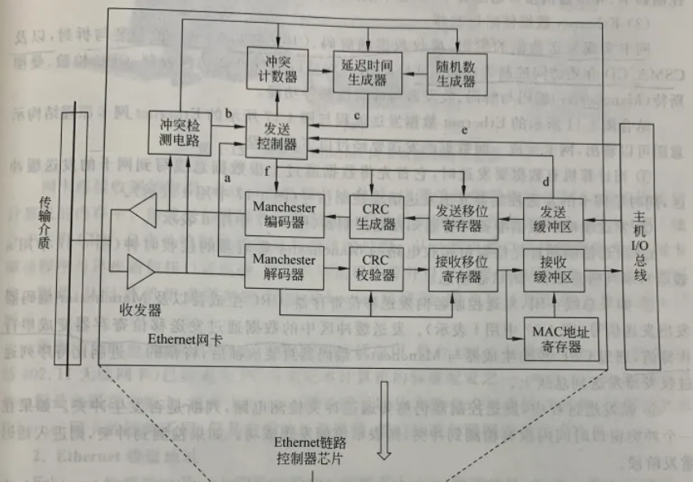

# 计算机网络

## 概述

#### 协议分层

##### 7层iso，osi参考模型

应用层、表示层、会话层、传输层、网络层、数据链路层、物理层

##### 5层因特网协议栈

应用层、传输层、网络层、数据链路层、物理层

应用层位于用户态，而传输层、网络层和部分数据链路层位于内核态，部分数据链路层和物理层为硬件

#### 网络和网络中的网络

分层：接入isp、区域isp、第一层isp

## 应用层

网络应用是计算机网络存在的理由

#### HTTP超文本传输协议

80号端口，基于tcp

+ 持续连接

+ 非持续连接

##### http请求报文

##### http响应报文

##### 方法字段

+ GET

+ POST

+ HEAD

+ PUT

+ DELETE

##### 状态码

+ 1xx 

+ 2xx

+ 3xx

+ 4xx

+ 5xx

##### http代理服务器

#### HTTPS

#### DNS域名系统

53号端口，在区域传输的时候使用TCP协议，其他时候使用UDP协议

##### 分级

+ 根dns服务器

+ 顶级域服务器

+ 权威dns服务器

+ 本地dns服务器

##### 查询

+ 递归

+ 迭代

##### dns缓存

## 传输层

#### UDP用户数据报协议

#### TCP传输控制协议

##### 可靠传输

+ 借助ack和seq两个字段确定，对于连接的双方，都维护着最近已确认的序列号

+ 从上层应用程序接收数据、超时、收到ack触发传送报文段

+ tcp保存已发送但未被接收的最小序列号和下一个要发送字节的序列号

+ 不采取回退n步或选择重传，tcp采取发送发送已发送但未被接收的最小序列号

##### 连接管理

+ 三次握手

+ 四次挥手

##### 超时重传

+ 超时

+ 快速重传：收到三个冗余ACK，意味着总共收到四个

##### 流量控制

+ 发送方维护winsize，这个由接收方发送表示自己接收方窗口大小

##### 拥塞控制

+ 慢启动

+ 拥塞避免

+ 快恢复

## 网络层

#### IP网际互连协议

##### IP地址

##### cider

##### 路由算法

##### OSPF

自治内部路由算法，基于链路状态算法(ls)

##### BGP

自治系统间路由选择协议，基于距离向量算法(dv)

#### 路由器

#### DHCP动态主机配置协议

67服务器，68客户端

##### discover message

##### offer message

##### request message

##### ack message

#### ICMP互连网控制消息协议

#### NAT网络地址转化协议

## 数据链路层

#### 多路访问链路和协议

##### 信道划分

##### 随机接入

##### 轮流协议

#### 局域网

##### ARP地址解析协议

##### 以太网

#### 网卡

#### 链路层交换机

#### 物理层集线器

# web页面请求历程

dzh同学想访问www.google.com。

首先我的电脑通过dhcp协议请求到ip地址。首先目的端口和源端口为67和68，首先发送discover报文，src为0.0.0.0，目的ip地址为255.255.255.255，会广播校园网，校园网的dhcp服务
器10.250.0.1获取到此报文后，将发送offer报文，提供ip地址10.250.74.134。我的电脑收到之后，发送request报文，src为0.0.0.0，目的ip地址为255.255.255.255向dhcp服务器
请求此ip地址，dhcp服务器收到后，发送ACK报文，确定相关信息。至此。我的电脑获取ip地址10.250.74.134

我在命令行中输入命令wget www.google.com， http提取www.google.com， 发送此字段给位于我电脑中的dns客户端。目的端口为53客户端将数据端封装，传入os内核，经过udp、ip、两层
、层的包装。dns服务器ip地址为8.8.8.8（忽略翻墙）。由于8.8.8.8和我的ip地址不在一个子网，所以使用arp协议查询默认网关10.250.0.1的mac地址.填充给以太网中的目的地mac地址
字段。然后通过网卡将此报文发送出去。首先是从我的电脑传递到默认网关。通过在校园网这一巨大的局域网中传递（其中有集线器和交换机），最终到达默认网关。注意这里会使用nat地
址转化，因为我的ip地址是内网ip地址，10.250.0.1通过查询nat表，将我的ip地址转换成相应端口号，以默认网关的外网ip地址传递出去。然后通过ospf路由算法，在路由器之间传递。
到达边际网关后使用bgp协议到达其他自治区域。最终到达位于美国的8.8.8.8dns服务器。这里默认使用递归查询，dns服务器提取com字段，查询获取相关顶级域服务器的ip地址，在通过此服
务器查询google字段的ip地址，获取后将该ip地址返回给根域名服务器8.8.8.8，8.8.8.8返回该ip地址，和原来的路线相反，该地址包裹在dns数据段中传递回来，目的地是默认网关的外
网ip地址，端口号则是nat转换的端口号。经过nat的转换恢复成10.250.74.134.然后再传递回来。至此，我获取到google.com的ip地址x，我电脑上的dns客户端将此ip地址给http

好，现在开始正式获取我所要请求的网页了。http首先建立和地址x的tcp链接，这里数据在底层传递的过程和上面类似，我就不赘述，这里着重讲述tcp。首先是三次握手。我的电脑发送
syn报文段，该报文段不携带任何数据段，seq字段填入通过随机化产生一个数据，syn标志位置为1。x收到后，也初始化seq字段填入通过随机化产生一个数据，syn标志位置为1，ack标志位置
为1（表示对客户端syn报文段的确认），ack字段设为客户端的seq字段+1，因为syn也占据一个比特位，发送回去为了防止洪范攻击，服务端不会先准备相关缓冲区和字段，而是使用特定哈希
函数计算客户发送的tcp头部的哈希值。我的电脑收到后，确定了连接的建立，准备相关内存缓冲区和相关字段的设置，现在可以发送带有数据段的tcp报文段，这个数据段就是http请求报文，
ack字段为服务端的seq字段+1，seq字段为之前的seq字段+1。服务端收到后，使用相同的哈希函数计算，老报文头和新的只有在seq字段上-1，计算结果相同后，服务器端可以确定连接的建
立，准备相关内存缓冲区和相关字段的设置，将数据段交付给上层的http，http读取相关字段，获取相关文件，传给tcp，服务端填写ack、seq、tcp数据段发送回去。慢启动发送两次后，第三
次超过阈值进入拥塞避免状态，从倍增变为一次增1第三次我的电脑迟迟没有收到，当定时器超时时，我的电脑将发送最早发送但是还未确定的报文段，这样累计发送三次，服务器端使用快速
重传，重传第三次应该发送的数据段，进入快速恢复状态，将ssthresh值变为cwnd/2，最后我的电脑成功收到最后的第三段，服务端重新变为拥塞避免。此时我的电脑获取到了google.com的
网页，通过浏览器将其显示在屏幕上。此时是时候将tcp连接断开。服务端在发送完最后的数据时，fin附上1，我的电脑收到后发送ack。最后我的电脑也发送fin报文段，服务端收到后发送ack
报文段，经过弥留后断开连接。至此，一个网页的获取到此结束。

# 报文接收和发送历程

在一开始，网卡驱动被注册，随后内核启动网卡，为网卡工作分配资源，如ringbuffer，并且将其写入网卡相关寄存器，并且注册硬中断处理函数e1000_intr

接收：

数据帧从外部网络到达网卡，我们的网卡经过简要处理后接收之，网卡在分配给自己的ringbuffer中找到合适的接收位置，找到后DMA将数据搬送过去，之后触发中断

cpu收到网卡硬中断，跳转到异常处理e1000_intr，其首先禁止中断

ksoftirqd 线程会从 Ring Buffer 中获取一个数据帧，用 sk_buff 表示，从而可以作为一个网络包交给网络协议栈进行逐层处理。

网卡驱动将位置信息写入网卡 RDT 寄存器，方便网卡继续往 ring buffer 填充数据

网卡驱动重新设置允许网卡触发硬中断

发送：

首先在应用层，调用send或者write函数将想传送的字节流写入套接字，内核会申请一个内核态的 sk_buff 内存，将用户待发送的数据拷贝到 sk_buff 内存，并将其加入到发送缓冲区。

网络协议栈从 Socket 发送缓冲区中取出 sk_buff，并按照 TCP/IP 协议栈从上到下逐层处理。传输层如果是tcp协议的话，需要拷贝一份保留，因为可能会重传

最后经过重重填充，最后放入网卡的发送队列中。此时触发软中断告诉网卡驱动程序，这里有新的网络包需要发送，驱动程序会从发送队列中读取 sk_buff，将这个 sk_buff 挂到 
RingBuffer 中，接着将 sk_buff 数据映射到网卡可访问的内存 DMA 区域，最后触发真实的发送。

当数据发送完成以后，网卡设备会触发一个硬中断来释放内存，主要是释放 sk_buff 内存和清理 RingBuffer 内存。最后，当收到这个 TCP 报文的 ACK 应答时，传输层就会释放sk_buff 。

