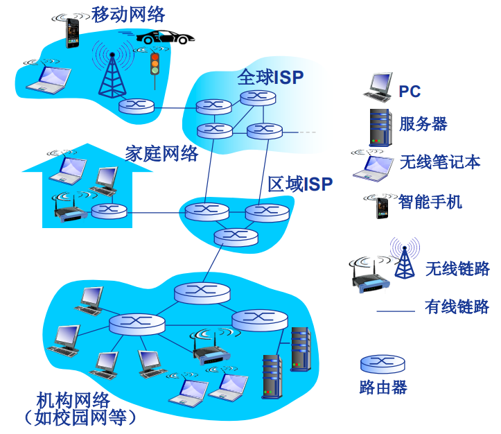

# 计算机网络

## 概述

#### Internet

全球最大的互联网，可以等同互联网，计算机网络

#### 架构

#### 组成

#### 网络的网络

#### 性能指标

+ 速率

+ 带宽

+ 时延：处理时延 排队时延 传输时延 传播时延

+ 往返时间rtt

+ 吞吐量

#### 协议分层

## 应用层

网络应用是计算机网络存在的理由

#### HTTP超文本传输协议

80号端口，基于tcp

+ 持续连接

+ 非持续连接

##### http请求报文

##### http响应报文

##### 方法字段

+ GET

+ POST

+ HEAD

+ PUT

+ DELETE

##### 状态码

+ 1xx 

+ 2xx

+ 3xx

+ 4xx

+ 5xx

##### http代理服务器

##### 浏览器缓存

+ 强制缓存

+ 协商缓存

#### HTTPS

#### DNS域名系统

53号端口，在区域传输的时候使用TCP协议，其他时候使用UDP协议

##### 分级

+ 根dns服务器

+ 顶级域服务器

+ 权威dns服务器

+ 本地dns服务器

##### 查询

+ 递归

+ 迭代

##### dns缓存

## 传输层

#### 

#### UDP用户数据报协议

#### TCP传输控制协议

##### 可靠传输

+ 借助ack和seq两个字段确定，对于连接的双方，都维护着最近已确认的序列号

+ 从上层应用程序接收数据、超时、收到ack触发传送报文段

+ tcp保存已发送但未被接收的最小序列号和下一个要发送字节的序列号

+ 不采取回退n步或选择重传，tcp采取发送发送已发送但未被接收的最小序列号

##### 连接管理

+ 三次握手

+ 四次挥手

##### 超时重传

+ 超时

+ 快速重传：收到三个冗余ACK，意味着总共收到四个

##### 流量控制

+ 发送方维护winsize，这个由接收方发送表示自己接收方窗口大小

##### 拥塞控制

+ 慢启动

+ 拥塞避免

+ 快恢复

tahoe reno

##### 保活机制

+ 进程崩溃

+ 主机崩溃

## 网络层

MTU：ip首部加数据段的最大长度

### IP协议

### 路由器

### IP地址

#### 子网

子网地址/掩码位数

##### 最长前缀匹配

##### 子网聚合

### 路由算法

#### 分类

+ 全局信息：链路状态（LS）路由算法，基于dijkstra算法

+ 邻居信息：距离向量（DV）路由算法，基于bellman-ford算法

#### 自治系统（AS）

整个互联网路由信息过大，分为as

网关路由器：位于AS“边缘”，通过链路连接其他AS的网关路由器

#### RIP

+ 内部路由算法，基于dv（16跳表示无穷大）

#### OSPF

+ 内部路由算法，基于ls

+ 链路状态通告只限于区内，每个路由器掌握所在区的详细拓扑，只知道去往其他区网络的“方向” (最短路径)

+ 分层OSPF：内部路由器，区域边界路由器，主干路由器，as边界路由器

#### BGP

自治系统之间路由器

##### 手段

+ eBGP: 从邻居AS获取子网可达性信息

+ iBGP: 向所有AS内部路由器传播子网可达性信息

##### 信息

+ AS-PATH(AS路径): 包含前缀通告所经过的AS序列: e.g., AS 67, AS 17

+ NEXT-HOP(下一跳)

##### 路由选择

+ 利用其输入策略决策接受/拒绝该路由 e.g., 从不将流量路由到AS x

+ 优先级

  - 本地偏好值属性: 策略决策
  
  - 最短AS-PATH 

  - 最近NEXT-HOP路由器: 热土豆路由
 
  - 附加准则
  

### icmp

### NAT

+ 利用(NAT IP地址,新端口号)替换每个外出IP数据报的(源IP地址,源端口号)

+ 将每对(NAT IP地址, 新端口号) 与(源IP地址, 源端口号)的替换信息存储到NAT转换表中

+ 根据NAT转换表，利用(源IP地址, 源端口号)替换每个进入内网IP数据报的(目的IP地址,目的端口号)，即(NAT IP地址, 新端口号)

### dhcp

+ 主机广播 “DHCP discover”(发现报文) 0，0，0，0 255，255，255，255

+ DHCP服务器利用 “DHCP offer” (提供报文) 进行响应 附上分配的ip地址

+ 主机请求IP地址: “DHCP request” (请求报文) 

+ DHCP服务器分配IP地址: “DHCP ack” (确认报文) 包括分配给客户的IP地址、子网掩码、默认网关、DNS服务器地址

### arp

+ 同一局域网，查询目的mac

+ 不同局域网，查询网关mac

## 数据链路层

#### 网卡

网卡是一个小型的计算机，有自己的处理器和内存

多路访问链路和协议通常在网卡中由硬件实现

链路层的实现：网卡、固件、软件

#### 多路访问链路和协议

##### 信道划分

##### 轮流协议

##### 随机接入

+ NIC从网络层接收数据报，创建数据帧

+ 监听信道：如果NIC监听到信道空闲，则开始发送帧

+ 如果NIC监听到信道忙，则一直等待到信道空闲，然后发送帧

+ NIC发送完整个帧，而没有检测到其他结点的数据发送，则NIC确认帧发送成功

+ 如果NIC检测到其他结点传输数据，则中止发送，并发送堵塞信号(jam signal)

+ 中止发送后，NIC进入二进制指数退避：

  - 第m次连续冲突后：取n = Min(m, 10)，
  
  - NIC 从{0,1,2, …, 2n-1}中随机选择一个数K
  
  - NIC等待K·512比特的传输延迟时间，再返回第2步

#### 局域网

##### MAC地址

##### 以太网协议

##### 以太网交换机

+ 存储-转发以太网帧

+ 检验到达帧的目的MAC地址，选择性(selectively) 向一个或多个输出链路转发帧

+ 利用CSMA/CD访问链路，发送帧

+ 主机感知不到交换机的存在

+ 即插即用 自学习

##### 虚拟局域网

## 串联汇总

在八股文中，有一个最常见的问题，浏览器里输入一段url，回车会发生啥。我觉得这是特别好的一个问题，从某种程度上，这个问题串联起了计算机网络五层几乎所有的知识点，下面我谈谈我的答案

#### DHCP

在此之前，咱们每台计算机都有一个ip地址，没有ip地址的计算机，是几乎不可能和外界计算机交流通信，所以，咱们的计算机首先必须通过DHCP协议获取ip地址。假设在我的计算机上输入google.com

+ hitsz校园局域网广播dhcp discover报文，该报文基于udp封装

+ 局域网内dhcp服务器收到后，发送dhcp offer报文，提供ip地址

+ 我的计算机从多个dhcp服务器中选择一个ip地址后，发送dhcp request报文请求分配该ip地址

+ 局域网内提供该ip地址的服务器发送dhcp ack报文，表示愿意提供该ip地址

ok，现在，我的计算机获取内网ip地址10.250.74.134

#### DNS

接下来，我们应该要解析出google.com的ip地址

+ 发送dns报文给本地dns服务器，假设本地dns服务器存在该ip地址，则直接返回，基于upd封装

+ 若不存在，则发送给根域名服务器，此时有两种解析方式，首先将递归

+ 根域名服务器发送给google对于的顶级域名服务器

+ 顶级域名服务器发送给对应的权威域名服务器，解析出最终ip地址6.6.6.6，返回给顶级域名服务器

+ 顶级域名服务器将该ip返回给根域名服务器，根域名服务器返回给本地dns服务器，本地dns服务器进行缓存，同时将6.6.6.6返回给我们计算机上的dns客户端

+ 接下来讲迭代

+ 根域名服务器解析出com的ip地址，发送给本地dns服务器

+ 本地dns服务器发送给com的顶级域名服务器，其解析出google.com的ip地址后返回给本地dns

+ 本地dns接下来发送给对应的权威域名服务器，其返回最终的google.com的ip地址

+ 本地dns缓存后，发送给我们的dns客户端

最终，我们获取到了google.com的ip地址6.6.6.6

#### http

接下来，就是像服务器正式发出请求的时候了，我们首先填充应用层http协议字段

+ 填写请求行：请求方法为GET，url为google.com，版本为1.1

+ 填写首部行，例如目标域名等

#### tcp

http是基于tcp协议

+ 填写源端口号和目的端口号

+ 随机初始化序列号seq，填写之

+ 填写确认号ack

+ 填写接收窗口

发送第一次握手，进入synsend状态。服务端收到后，同样进行上述操作，将ack变为第一次握手的seq + 1，发送回来，进入synrecieve状态。最客户端收到第二次握手后，发送第三次握手对第二次进行确认，进入establish状态。

#### ip

上层发送的所有数据都需要经过ip层，填写原ip地址和目的ip地址后，发送到下一层

#### arp

地址解析协议，作用是让报文在局域网内传输，需要填写目的mac地址和源mac地址，首先查看本地缓存，是否有目的ip地址的mac地址，若有则直接使用，若没有，则发送arp request报文进行广播，由于该ip地址是外网ip地址，所以网关10.250.0.1接收到后，发送arp response报文返回自己的mac地址，本地收到后，填充好目的mac地址后，发送到网卡

#### 网卡

注意，网络链路上可能有报文在传输，一般网卡是通过csma/cd载波侦听多路访问信道将要发送的报文发送出网卡

+ 等待信道没有数据传输

+ 将报文发送出网卡

+ 检测到冲突，采取二进制指数回退策略避免冲突

+ 最终，数据被顺利传出网卡

#### 局域网通信

物理层的集线器，链路层的交换机通过目的mac地址进行转发，最终，到达了我们的局域网网关

#### 网关

网关首先nat协议，将我们的内网ip转化为外网ip加上端口号后，发送到因特网上了

#### 因特网

在因特网上，若是同一个自治区域，则采取ospf的路由算法，基于迪杰斯特拉算法，若是跨自治区域，则采用bgp算法，基于贝尔曼福德算法，最终，跨国重洋，到达彼岸的6.6.6.6服务器，完成一次数据传输，回来的过程，也是类似的。

#### tcp

最后，我们的客户端表示本次数据传输已经完成，要关闭tcp连接。

+ 发送fin报文，客户端进入fin wait1状态

+ 服务端接收后，发送ack，进入close wait状态

+ 客户端收到ack后进入fin wait2状态

+ 服务端发送fin报文，等待最后一次ack，进入last ack状态

+ 客户端接收后，发送ack，进入time wait状态，等待2 * T，确保所有报文消亡，以及确保没有服务端的超时重传

+ 服务端收到最后一次ack后，关闭连接

+ 客户端2 * T后关闭连接。

ok，结束

#### icmp

有时候，报文在路上出现故障，如ip地址不存在或者ip跳数耗尽，或者使用ping的时候，咱们会使用icmp协议

+ 若跳数耗尽，则耗尽处的路由器往回发送差错报文，表示跳数耗尽

+ ping的时候，一端发送icmp请求报文，回显请求，一段发送回显应答

+ 若目的主机ip不存在，或者端口不存在，会发送差错报文，主句不可达或者端口不可达

