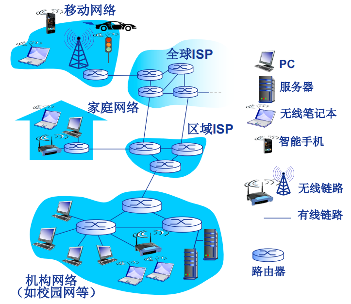
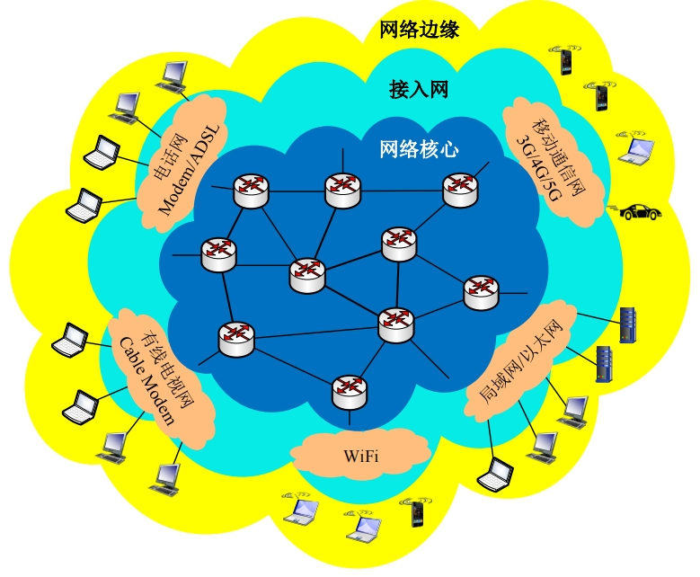
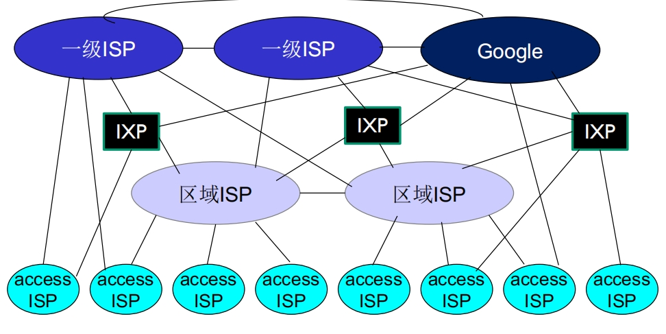

# 计算机网络

## 概述

计算机网络存在的意义：使得不同计算机之间可以进行通信。

#### Internet架构

全球最大的互联网，可以等同互联网，这是网络中的网络，通过光纤电缆、交换机、路由器和网络协议组成。

#### 性能指标

+ 速率

+ 带宽

+ 时延：处理时延 排队时延 传输时延 传播时延

+ 往返时间rtt

+ 吞吐量

#### 输入url到返回的过程

dhcp udp 获取本机ip地址

arp 获取网关mac地址

http tcp三次握手（ syn; syn ack; ack） ip arp（外网则走网关mac地址）;以太网；物理网卡

交换机 nat协议 路由器（ispf bgp边际网关）

收到消息

tcp四次挥手（服务端fin ack fin ack 两倍来回）

## 应用层

网络应用是计算机网络存在的理由

#### HTTP超文本传输协议

80号端口，基于tcp

+ 持续连接

+ 非持续连接

##### http请求报文

##### http响应报文

##### 方法字段

+ GET

+ POST

+ HEAD

+ PUT

+ DELETE

##### 状态码

+ 1xx 

+ 2xx

+ 3xx

+ 4xx

+ 5xx

##### http代理服务器

##### 浏览器缓存

+ 强制缓存

+ 协商缓存

#### HTTPS

#### DNS域名系统

53号端口，在区域传输的时候使用TCP协议，其他时候使用UDP协议

##### 分级

+ 根dns服务器

+ 顶级域服务器

+ 权威dns服务器

+ 本地dns服务器

##### 查询

+ 递归

+ 迭代

##### dns缓存

## 传输层

#### 多路复用

#### UDP用户数据报协议

#### TCP传输控制协议

##### 可靠传输

+ 借助ack和seq两个字段确定，对于连接的双方，都维护着最近已确认的序列号

+ 从上层应用程序接收数据、超时、收到ack触发传送报文段

+ tcp保存已发送但未被接收的最小序列号和下一个要发送字节的序列号

+ 不采取回退n步或选择重传，tcp采取发送发送已发送但未被接收的最小序列号

##### 连接管理

+ 三次握手

+ 四次挥手

##### 超时重传

+ 超时

+ 快速重传：收到三个冗余ACK，意味着总共收到四个

##### 流量控制

+ 发送方维护winsize，这个由接收方发送表示自己接收方窗口大小

##### 拥塞控制

+ 慢启动

+ 拥塞避免

+ 快恢复

tahoe reno

##### 保活机制

+ 进程崩溃

+ 主机崩溃

## 网络层

MTU：ip首部加数据段的最大长度

### IP协议

### IP地址

+ 子网

+ 子网聚合

+ 最长前缀匹配

### 路由算法

#### 分类

+ 链路状态（LS）路由算法，基于dijkstra算法

+ 距离向量（DV）路由算法，基于bellman-ford算法

#### 自治系统（AS）

整个互联网路由信息过大，分为as

网关路由器：位于AS“边缘”，通过链路连接其他AS的网关路由器

#### RIP

+ 内部路由算法，基于dv（16跳表示无穷大）

#### OSPF

+ 内部路由算法，基于ls

#### BGP

自治系统之间路由算法

### icmp

### NAT

### dhcp

+ 主机广播 “DHCP discover”(发现报文) 0，0，0，0 255，255，255，255

+ DHCP服务器利用 “DHCP offer” (提供报文) 进行响应 附上分配的ip地址

+ 主机请求IP地址: “DHCP request” (请求报文) 

+ DHCP服务器分配IP地址: “DHCP ack” (确认报文) 包括分配给客户的IP地址、子网掩码、默认网关、DNS服务器地址

### arp

+ 同一局域网，查询目的mac

+ 不同局域网，查询网关mac

## 数据链路层

#### 网卡

#### 载波侦听多路访问协议

#### 局域网

##### MAC地址

##### 以太网协议

##### 以太网交换机

+ 存储-转发以太网帧

+ 检验到达帧的目的MAC地址，选择性(selectively) 向一个或多个输出链路转发帧

+ 利用CSMA/CD访问链路，发送帧

+ 主机感知不到交换机的存在

+ 即插即用 自学习
